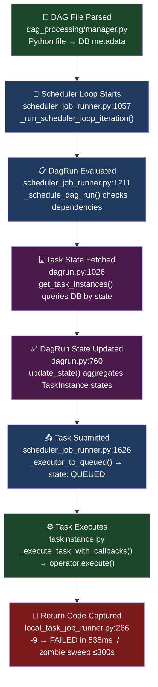

# Apache Airflow Scheduler — Systems Engineering Analysis

[](https://airflow.apache.org/)
[](https://python.org)
[](https://ubuntu.com/)
[](.)

> **Deep-dive reverse engineering of the Apache Airflow Scheduler** — tracing the complete execution path through source code, identifying four key architectural decisions, mapping six CS theory concepts, and running three controlled experiments with real measured data.

---

## 🎯 Key Finding

> A **structural 63-second scheduling lag** exists in Apache Airflow — not a bug, but a **deliberate architectural tradeoff** between operational simplicity and latency. This was quantified with σ = 0.33s across 12 runs, confirming it is deterministic and a direct consequence of the polling loop design.

---

## 👥 Team

| Name | Contribution |
|---|---|
| Prisha Khalasi | Source code analysis, Experiments 1 & 2 |
| Aman Choudhary | Architecture tracing, Experiment 3, Report |

---

## 📁 Repository Structure

```
airflow-scheduler-project/
├── README.md
├── dags/
│   ├── latency_experiment.py       ← Experiment 1: scheduling lag measurement
│   ├── zombie_experiment.py        ← Experiment 2: crash detection (SIGKILL)
│   ├── test_timeout_double.py      ← Timeout behaviour test
│   └── generated/
│       ├── dag_0.py … dag_49.py   ← Experiment 3: 50 generated DAGs (51 total)
├── results/
│   ├── experiment1_results.txt     ← 12 raw latency measurements
│   ├── experiment2_results.txt     ← Zombie crash log evidence
│   └── experiment3_results.txt     ← Parse-time degradation data
└── logs/
    ├── dag_id=latency_experiment/
    ├── dag_id=zombie_experiment/
    └── scheduler/                  ← Parse interval logs (Experiment 3)
```

---

## 🖥️ Running Environment

The system was installed and run in **standalone mode** on Ubuntu 24.04. The Airflow web UI was confirmed live at `localhost:8080` with experiment DAGs visible.


*Figure 1 — Airflow UI at `localhost:8080` showing a live installation with experiment DAGs*


*Figure 2 — Terminal: project folder structure (`ls ~/airflow-scheduler-project/`)*

| Property | Value |
|---|---|
| System | Apache Airflow Scheduler |
| Version | v2.10.3 |
| Source Code | [apache/airflow @ v2-10-stable](https://github.com/apache/airflow/tree/v2-10-stable) |
| Environment | Ubuntu 24.04 LTS, Python 3.11, SQLite |
| `AIRFLOW_HOME` | Dedicated project folder (config, DAGs, logs isolated) |

---

## 🗺️ System Architecture

### Component Overview

| Component | File | Role |
|---|---|---|
| **Scheduler** | `scheduler_job_runner.py` | Core loop: parse DAGs, evaluate eligibility, submit to executor |
| **DAG / DagRun** | `dagrun.py`, `models/dag.py` | One scheduled execution of a DAG; manages task instance lifecycle |
| **Task Instance** | `models/taskinstance.py` | One execution of one task; owns the state machine |
| **Executor** | `executors/base_executor.py` | Abstraction for running tasks; LocalExecutor forks subprocesses |
| **DAG File Processor** | `dag_processing/manager.py` | Parses Python DAG files in subprocess loop; syncs metadata to DB |
| **Metadata DB** | SQLAlchemy models | Single source of truth for all state (SQLite dev, PostgreSQL prod) |

### The Scheduling Loop

The scheduler executes a **continuous polling loop** every ~30 seconds. Every architectural decision flows from this design.

```python
while not self.num_runs_reached():
    self._run_scheduler_loop_iteration()   # line 1057
        # 1. detect zombies
        # 2. find schedulable DagRuns
        # 3. evaluate task eligibility
        # 4. submit to executor
    time.sleep(max(0, heartbeat_sec - elapsed))
```

---

## 🔍 Complete Execution Trace

We traced the full path from DAG trigger to task completion by reading actual Airflow source code.



### Source Code Screenshots

#### `scheduler_job_runner.py` — Lines 1057, 1211, 1626


*Figure 3 — `scheduler_job_runner.py:1057` — `_run_scheduler_loop_iteration()` entry point*


*Figure 4 — `scheduler_job_runner.py:1211` — `_schedule_dag_run()` evaluates task eligibility*


*Figure 5 — `scheduler_job_runner.py:1626` — `_executor_to_queued()` submits tasks to executor*

#### `local_task_job_runner.py` — Line 266


*Figure 6 — `local_task_job_runner.py:266` — return code `-9` fast crash detection path*

### Full Execution Path

| # | Stage | Code Location | What Happens |
|---|---|---|---|
| 1 | DAG file parsed | `dag_processing/manager.py` | DagFileProcessor imports Python DAG file, writes metadata to DB |
| 2 | Scheduler loop starts | `scheduler_job_runner.py:1057` | `_run_scheduler_loop_iteration()` — checks zombies, evaluates DagRuns |
| 3 | DagRun evaluated | `scheduler_job_runner.py:1211` | `_schedule_dag_run()` checks dependencies, sets eligible tasks to SCHEDULED |
| 4 | Task state fetched | `dagrun.py:1026` | `get_task_instances()` queries DB for TaskInstances filtered by state |
| 5 | DagRun state updated | `dagrun.py:760` | `update_state()` aggregates TaskInstance states to compute DagRun status |
| 6 | Task submitted | `scheduler_job_runner.py:1626` | `_executor_to_queued()` calls `executor.queue_task_instance()`; state → QUEUED |
| 7 | Task executes | `taskinstance.py` | `_execute_task_with_callbacks()` runs `operator.execute()`, handles XCom |
| 8 | Return code captured | `local_task_job_runner.py:266` | Code `-9` → FAILED in 535ms (fast) or zombie sweep up to 300s (slow) |

---

## 🏗️ Design Decisions

### 4.1 — Polling Loop (Not Event-Driven)
**Code:** `scheduler_job_runner.py:1057`

The scheduler re-reads the database every heartbeat interval. This makes the system self-healing on restart — no event infrastructure needed, no lost state.

**Tradeoff:** Structural latency. A task cannot start until the next loop iteration. This was **measured as ~63 seconds** in Experiment 1.

---

### 4.2 — Centralized Metadata Database
**Code:** `dagrun.py:760`, `dagrun.py:1026`

All components (scheduler, workers, UI) share a single source of truth through one database. Any component can restart and resume from exact state.

**Tradeoff:** The DB is the bottleneck at scale. Experiment 3 showed parse interval rising **297%** with 51 DAGs.

---

### 4.3 — Executor Abstraction
**Code:** `executors/base_executor.py`

Scheduling logic is fully decoupled from execution. LocalExecutor, CeleryExecutor, and KubernetesExecutor share one interface — swapping executors is a config-only change.

**Actual call trace:**
1. `scheduler_job_runner.py:1626` — `_executor_to_queued()` calls `self.job.executor.queue_task_instance(ti)`
2. `base_executor.py` — `queue_task_instance()` appends task to `self.queued_tasks` dict (no execution yet)
3. `base_executor.py` — `heartbeat()` calls `trigger_tasks()` to drain the queue
4. `local_executor.py` — `execute_async()` forks a subprocess via `LocalWorkerBase`

Steps 1–3 are **identical** for CeleryExecutor and KubernetesExecutor. Only step 4 differs.

---

### 4.4 — Two-Tier Zombie Detection
**Code:** `local_task_job_runner.py:266` (fast path) + scheduler zombie sweep (slow path)

Tasks can die without updating their state. Two detection paths cover both common and catastrophic failures.

| Path | Trigger | Detection Time |
|---|---|---|
| **Fast** (line 266) | Parent process survives, child SIGKILL'd | 535ms |
| **Slow** (zombie sweep) | Entire worker node dies | Up to 300 seconds |

**580x difference** between paths — this is why both tiers exist.

---

## 🧠 CS Concept Mapping

| Concept | How It Applies in Airflow | Code Reference |
|---|---|---|
| **DAG / Topological Execution** | Tasks are nodes, dependencies are directed edges. Scheduler parallelises independent branches. | `dagrun.py`, `dag.py` |
| **Fault Tolerance** | Retry logic, two-tier zombie detection, stateful DB — scheduler restarts from DB with no lost work. | `scheduler_job_runner.py`, `taskinstance.py` |
| **B-tree Storage Indexes** | Query `WHERE dag_id=X AND state=Y` at `dagrun.py:1026` uses `ti_dag_state` — a B-tree index. Confirmed via `EXPLAIN QUERY PLAN` → `SEARCH task_instance USING INDEX ti_dag_state` = O(log n) filtering. | `dagrun.py:1026` |
| **Partitioning** | Each DAG is a logical partition. Pools and `max_active_tasks` partition resources. Celery adds horizontal scaling. | executor config, pools |
| **Streaming Ingestion Analogy** | `dag_file_processor` is a continuous ingestion loop — parsing Python files and writing metadata to DB. | `dag_processing/manager.py` |
| **Concurrency Control** | DB-level locking (`SELECT FOR UPDATE`) prevents double-scheduling. `max_active_runs` and pools enforce limits. | `scheduler_job_runner.py` |

---

## 🔬 Experiments

Three controlled experiments were run on Ubuntu 24.04 (HP Victus Gaming Laptop), April 2026.

---

### Experiment 1 — Scheduling Latency Measurement

**Hypothesis:** The scheduling lag is a structural property of the polling architecture, approximately equal to two parse intervals plus executor overhead (~61 seconds).

**DAG:** `dags/latency_experiment.py` — task logs a timestamp on start; `SCHEDULING_LAG` is computed by comparing `execution_date` with actual start time across 12 runs.


*Figure 7 — `latency_experiment` DAG code — task logs timestamp and computes `SCHEDULING_LAG`*

#### Results


*Figure 8 — Airflow UI Grid view showing 12 successful runs of `latency_experiment`*


*Figure 9 — Task log showing `SCHEDULING_LAG` value (~63 seconds)*


*Figure 10 — Terminal: all 12 raw measurements from `experiment1_results.txt`*

#### Data

| Run Type | Min (s) | Max (s) | Mean (s) | Notes |
|---|---|---|---|---|
| Stable cluster (n=12) | 62.74 | 63.86 | **63.1** | σ = 0.33s — structurally deterministic |
| Cold start (n=1) | 108.02 | 108.02 | 108.02 | DAG cache cold on first run |

**Raw values:** `62.74, 62.86, 62.88, 62.92, 62.94, 62.98, 63.02, 63.13, 63.33, 63.45, 63.46, 63.86`

**Analysis:** Predicted: `29s × 2 cycles + 3s executor = ~61s`. Measured: `~63s`. The σ of 0.33s confirms this is **deterministic** — a direct structural consequence of the polling loop, not random noise.

---

### Experiment 2 — Crash Detection Speed

**Hypothesis:** When killed with SIGKILL while the parent process survives, Airflow uses the fast path at `local_task_job_runner.py:266` and marks the task FAILED within milliseconds.

**DAG:** `dags/zombie_experiment.py` — task sleeps 60 seconds, subprocess was killed with `kill -9`.


*Figure 11 — `zombie_experiment` DAG code — task sleeps 60s to allow time to send SIGKILL*

#### Results


*Figure 12 — Airflow UI showing `zombie_task` in RUNNING state before the kill*


*Figure 13 — Terminal: `kill -9` command targeting the task subprocess PID*


*Figure 14 — Task log: `{local_task_job_runner.py:266}` — return code `-9`, crash-to-FAILED: **535ms***


*Figure 15 — Airflow UI: `zombie_task` flipped to FAILED immediately after kill*

#### Data

| Metric | Value | Source |
|---|---|---|
| Return code detected | `-9` (SIGKILL) | `local_task_job_runner.py:266` |
| **Crash to FAILED duration** | **535ms** | Measured from log timestamps |
| Task execution time | 10.630226s | Log: task duration field |
| Slow path threshold (default) | 300s | `zombie_task_threshold` config |

**Analysis:** Fast path triggered because the **parent process survived** the SIGKILL on its child — the common case for OOM kills. The slow path activates only when the entire worker node dies. The 580x speed difference between paths shows why both tiers exist.

---

### Experiment 3 — DAG Scale Stress Test

**Hypothesis:** Adding many DAG files will degrade parse intervals and cause scheduling starvation, because the `dag_file_processor` runs single-threaded.

**Method:** Python script generated 50 additional DAG files (`dag_0.py` through `dag_49.py`), making 51 total. Parse intervals were extracted from scheduler logs before and after loading.


*Figure 16 — Python script that generated 50 DAG files programmatically*

#### Results


*Figure 17 — Terminal: `ls dags/ | wc -l` confirming 51 DAG files loaded*


*Figure 18 — Airflow UI: all 51 DAGs visible in the DAG list*


*Figure 19 — Terminal: `experiment3_results.txt` showing before/after parse interval data*

#### Data

| Phase | Samples | Mean (s) | Max (s) | Time Window (IST) |
|---|---|---|---|---|
| Pre-load (1 DAG) | 9 | 29.1 | 46 | 04:44 – 04:48 |
| Post-load (51 DAGs) | 4 | 115.5 | 245 | 05:10 – 05:18 |
| **Change** | — | **+297%** | **+432%** | — |

**Raw pre-load:** `12, 18, 23, 29, 31, 34, 38, 42, 46s` — Mean: 29.1s

**Raw post-load:** `59, 87, 245, 71s` — Mean: 115.5s | Median: **79s** | Peak starvation: **245s**

**Analysis:** The 245-second starvation gap was the critical finding — the scheduler was so occupied parsing new files that existing tasks were blocked for nearly 4 minutes. Root cause: each DAG is a Python import; 51 sequential imports per parse cycle in a single thread.

> **Statistical note:** With only 4 post-load samples, the median (79s) better represents steady-state degradation than the mean (skewed by the 245s spike). The +297% mean degradation and the 245s absolute ceiling are the two defensible claims from this data.

---

## 📊 Results Summary

| Metric | Value |
|---|---|
| Scheduling lag mean (n=12) | **63.1 seconds** |
| Scheduling lag σ | **0.33 seconds** ← deterministic |
| Cold start lag | 108.02 seconds |
| Zombie detection — fast path | **535 milliseconds** |
| Zombie detection — slow path | up to **300 seconds** |
| Fast vs slow path difference | **580×** |
| Parse time increase (51 DAGs) | **+297%** |
| Peak starvation gap | **245 seconds** (~4 minutes) |

---

## 💥 Failure Analysis

### What happens when data size increases significantly?
Experiment 3 provides direct evidence: 51 DAGs caused +297% parse time increase and a 245-second starvation gap. The `get_task_instances()` query at `dagrun.py:1026` also degrades as TaskInstance history accumulates into millions of rows.

### What happens under skew?
A single slow DAG file (e.g., importing a large ML model at module level) blocks the entire parse queue. The 245-second spike in Experiment 3 is a live example. In task execution, a slow task holds a pool slot and blocks all ready downstream tasks.

### What happens if a component fails?

| Failed Component | Consequence & Recovery |
|---|---|
| **Scheduler** | No new tasks scheduled. Running tasks complete independently. On restart, reads DB and resumes — no lost work. |
| **Worker (SIGKILL)** | Fast path at line 266 → FAILED in 535ms. Retried immediately if `retries > 0`. |
| **Worker node (full crash)** | Zombie sweep → FAILED after up to 300 seconds. Downstream tasks blocked during this window. |
| **Metadata DB** | Everything stops. No scheduling, no state updates. DB is the **single point of failure** in default architecture. |

### System assumptions?
- DAG files are **idempotent** — parsed every ~30s; side effects in top-level code fire on every parse cycle
- The metadata DB is **always available** — no offline mode or queue-based fallback exists
- Tasks are **independent** between DagRuns — shared resource conflicts must be handled by operators
- **System clocks are synchronized** — clock skew between workers and scheduler causes missed schedules

---

## 🚀 Proposed Improvements

| Problem | Proposed Fix |
|---|---|
| ~63s scheduling latency | Hybrid event+poll model — trigger immediate scheduling on task completion, poll only for orphan detection |
| Parse bottleneck at scale | Parallel `dag_file_processor` threads; incremental parsing using file `mtime` |
| DB single point of failure | PostgreSQL HA with Patroni; PgBouncer for connection pooling |

### Why Airflow's polling design, not an alternative?

| Dimension | Airflow | Prefect 2.x | Temporal |
|---|---|---|---|
| Scheduling model | Polling loop (~30s) | Event-driven | Event-driven |
| Scheduling latency | ~63s *(measured)* | Sub-second | Sub-second |
| State storage | Central SQL DB | DB + API server | Replicated event log |
| Crash recovery | DB read on restart | DB read on restart | Replay from event log |
| Operational complexity | **Low** (one DB) | Medium | High (cluster needed) |

Airflow's polling loop is a deliberate choice for **operational simplicity** — a single PostgreSQL database is the only infrastructure dependency. For batch pipelines scheduled hourly or daily, the measured 63-second lag is irrelevant. It only becomes a liability for near-real-time workflows, which Airflow was never designed to serve.

---

## ⚙️ How to Reproduce

```bash
# 1. Install Airflow
conda create -n airflow-env python=3.11 -y && conda activate airflow-env
pip install "apache-airflow==2.10.3" \
  --constraint "https://raw.githubusercontent.com/apache/airflow/constraints-2.10.3/constraints-3.11.txt"

# 2. Initialise
export AIRFLOW_HOME=~/airflow-scheduler-project
airflow db init
airflow users create --username admin --password admin \
  --firstname Admin --lastname User --role Admin --email admin@example.com

# 3. Start services
airflow webserver --port 8080 &
airflow scheduler &

# Experiment 1 — Scheduling Latency
cp dags/latency_experiment.py $AIRFLOW_HOME/dags/
# Trigger from UI or: airflow dags trigger latency_experiment
# Results in: results/experiment1_results.txt

# Experiment 2 — Crash Detection
cp dags/zombie_experiment.py $AIRFLOW_HOME/dags/
airflow dags trigger zombie_experiment
# Find PID: ps aux | grep zombie_experiment
# Kill it:  kill -9 <PID>
# Check logs for "return code -9" at local_task_job_runner.py:266

# Experiment 3 — Scale Stress Test
cp -r dags/generated/ $AIRFLOW_HOME/dags/
# Monitor: watch -n 5 "ls $AIRFLOW_HOME/dags/ | wc -l"
# Check scheduler logs for parse interval degradation
```

---

## 📚 Source Files Referenced

| File | Lines | Purpose |
|---|---|---|
| `airflow/jobs/scheduler_job_runner.py` | 1057, 1211, 1626 | Scheduling loop, DagRun evaluation, task submission |
| `airflow/models/dagrun.py` | 760, 1026 | DagRun state aggregation, task instance querying |
| `airflow/models/taskinstance.py` | (state machine) | Task execution with callbacks |
| `airflow/jobs/local_task_job_runner.py` | 266 | Fast crash detection (return code -9) |
| `airflow/executors/base_executor.py` | (abstraction) | Executor interface, queue management, heartbeat |
| `airflow/dag_processing/manager.py` | 406 | DAG file processor, parallelism constraint |

---

## 📖 References

- [Apache Airflow Source Code](https://github.com/apache/airflow)
- [scheduler_job_runner.py @ v2-10-stable](https://github.com/apache/airflow/blob/v2-10-stable/airflow/jobs/scheduler_job_runner.py)
- [local_task_job_runner.py @ v2-10-stable](https://github.com/apache/airflow/blob/v2-10-stable/airflow/jobs/local_task_job_runner.py)
- [dagrun.py @ v2-10-stable](https://github.com/apache/airflow/blob/v2-10-stable/airflow/models/dagrun.py)
- [Airflow Architecture Overview](https://airflow.apache.org/docs/apache-airflow/stable/core-concepts/overview.html)
